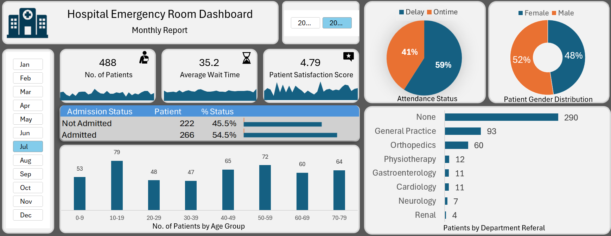

# 🏥 Hospital Emergency Room Dashboard

An interactive **Microsoft Excel Dashboard** developed to analyze hospital emergency room operations and present key performance indicators (KPIs) through dynamic visualizations.

This project was created as part of my learning journey to strengthen my Excel and data analysis skills by working with a healthcare dataset and building an interactive dashboard.

---

## 📊 Dashboard Preview

> Replace the image path below with your uploaded screenshot.

---

## 🎯 Project Objectives

- Analyze emergency room patient data
- Track key hospital performance metrics
- Build an interactive dashboard using Microsoft Excel
- Practice creating business-oriented reports and visualizations

---

## ✨ Dashboard Features

- 📌 Interactive Monthly Slicer
- 📌 KPI Cards
  - Total Patients
  - Average Wait Time
  - Patient Satisfaction Score
- 📌 Admission Status Analysis
- 📌 Patient Attendance Status
- 📌 Gender Distribution
- 📌 Age Group Analysis
- 📌 Department Referral Analysis
- 📌 Interactive Pivot Charts

---

## 🛠️ Tools & Techniques Used

- Microsoft Excel
- Pivot Tables
- Pivot Charts
- Slicers
- Excel Tables
- Conditional Formatting
- Data Cleaning
- Data Visualization
- Dashboard Design

---

## 📈 Key Metrics Displayed

| Metric | Description |
|---------|-------------|
| Total Patients | Total number of patients visiting the emergency room |
| Average Wait Time | Average patient waiting time |
| Patient Satisfaction Score | Overall patient satisfaction rating |
| Admission Status | Admitted vs Not Admitted patients |
| Attendance Status | On-time vs Delayed patient arrivals |
| Gender Distribution | Male vs Female patients |
| Age Group Analysis | Distribution of patients across age groups |
| Department Referrals | Referrals to various hospital departments |

---

## 📚 What I Learned

Through this project, I gained practical experience in:

- Designing interactive Excel dashboards
- Creating and formatting Pivot Tables
- Building Pivot Charts
- Connecting multiple Pivot Tables using Slicers
- Creating KPI Cards
- Cleaning and organizing data
- Presenting business insights through data visualization
- Applying dashboard design best practices

---

## 💡 Business Insights

The dashboard enables users to quickly understand:

- Overall patient volume
- Average waiting time
- Patient satisfaction trends
- Admission rates
- Patient demographics
- Department referral distribution
- Monthly operational performance

---

## 🚀 Future Improvements

- Build the same dashboard using Power BI
- Connect the dashboard to live data using Power Query
- Add additional KPIs and trend analysis
- Automate dashboard refresh
- Improve visual design and accessibility

---

## 🙏 Acknowledgement

This project was developed as part of my learning journey by following the tutorial below and recreating the dashboard to better understand Excel dashboard development, data visualization, and reporting concepts.

**Tutorial:**
Complete Excel Project with Interactive Dashboard | Resume Project | Step-by-Step Tutorial

https://youtu.be/503-_4XI_qA

---

## 👨‍💻 Author

**Harshal Ahire**

- LinkedIn: https://www.linkedin.com/in/harshal-ahire07
- GitHub: https://github.com/harshalahire07

---

⭐ If you found this project helpful or interesting, feel free to star the repository.
